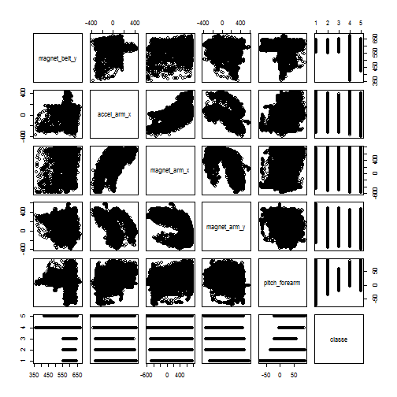
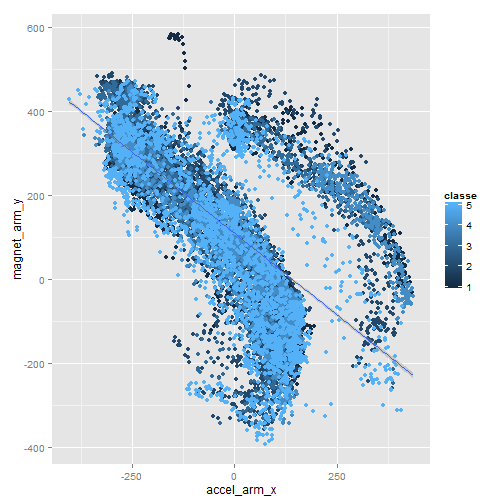
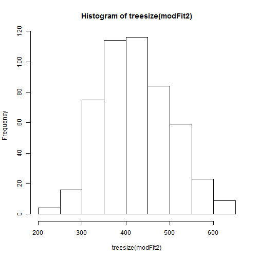
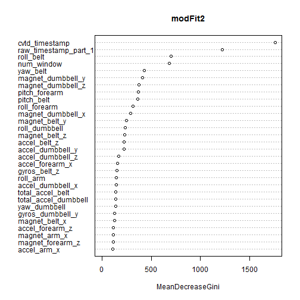
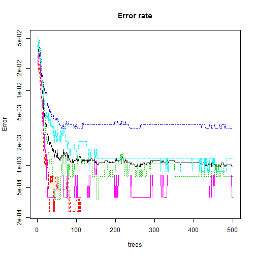

Title: "Machine learning".


The goal of the project is to predict the manner in which they did the exercise.  At the first stage, we have loaded the data and clean them. Initial data consists of 19622 entries with 160 variables. The variable the "classe"  will be marked as outcome, whereas the rest one will use as predictors. We have removed variables with NA and have converted factor variables to numeric. After this procedure, number of predictors is 60. Moreover, we have exclude variables with small deviation and the variable X as index. 


```r
dataset<-read.csv("C:/coursera/machine_learning/pml-training.csv", header=TRUE)
ind0<-rep(0,0)
for (i in 1:dim(dataset)[2]){if (anyNA(dataset[,i])==TRUE) ind0<-c(ind0, i)}
dataset<-dataset[,-ind0]
ind1<-c(1, 3:4, 7:92)
for (i in 1:length(ind1)) {dataset[,ind1[i]]<-as.numeric(as.character(dataset[,ind1[i]]))}
```

```
## Warning: NAs introduced by coercion
## Warning: NAs introduced by coercion
## Warning: NAs introduced by coercion
## Warning: NAs introduced by coercion
## Warning: NAs introduced by coercion
## Warning: NAs introduced by coercion
## Warning: NAs introduced by coercion
## Warning: NAs introduced by coercion
## Warning: NAs introduced by coercion
## Warning: NAs introduced by coercion
## Warning: NAs introduced by coercion
## Warning: NAs introduced by coercion
## Warning: NAs introduced by coercion
## Warning: NAs introduced by coercion
## Warning: NAs introduced by coercion
## Warning: NAs introduced by coercion
## Warning: NAs introduced by coercion
## Warning: NAs introduced by coercion
## Warning: NAs introduced by coercion
## Warning: NAs introduced by coercion
## Warning: NAs introduced by coercion
## Warning: NAs introduced by coercion
## Warning: NAs introduced by coercion
## Warning: NAs introduced by coercion
## Warning: NAs introduced by coercion
## Warning: NAs introduced by coercion
## Warning: NAs introduced by coercion
## Warning: NAs introduced by coercion
## Warning: NAs introduced by coercion
## Warning: NAs introduced by coercion
## Warning: NAs introduced by coercion
## Warning: NAs introduced by coercion
## Warning: NAs introduced by coercion
```

```r
ind2<-rep(0,0)
for (i in 1:dim(dataset)[2]){if (anyNA(dataset[,i])==TRUE) ind2<-c(ind2, i)}
dataset<-dataset[,-ind2]
rm(i)

library(caret)
```

```
## Warning: package 'caret' was built under R version 3.1.1
```

```
## Loading required package: lattice
## Loading required package: ggplot2
```

```
## Warning: package 'ggplot2' was built under R version 3.1.1
```

```r
nsvar<-nearZeroVar(dataset, saveMetrics=TRUE)
zeroVar<-which(nsvar$nzv==TRUE) #%% zero variables
un<-which(nsvar$percentUnique<0.02)
zerovar<-unique(c(zeroVar, un))
dataset<-dataset[,-c(1,zeroVar)]

rm(nsvar)
rm(un)
```

The next step is splitting the dataset into training and testing sets. The splitting proportion is 0.75 for the classe variable.


```r
inTrain<-createDataPartition(y=dataset$classe, p = 0.75, list=FALSE)
training<-dataset[inTrain,]
testing<-dataset[-inTrain,]
dim(training)
```

```
## [1] 14718    58
```

```r
dim(testing)
```

```
## [1] 4904   58
```
We have continued to work on the testing data. We have calculated a correlation matrix for numeric variables. The variables roll_belt pitch_belt, gyros_belt_y, gyros_belt_z, accel_belt_x, accel_belt_y, yaw_arm, total_accel_arm, gyros_arm_y, accel_arm_y, accel_arm_z, magnet_arm_x, magnet_arm_z, roll_dumbbell, gyros_dumbbell_y, accel_dumbbell_x are higly correlated with each other. So we need to explore them with PCA. From this lst, the variables magnet_belt_y,   accel_arm_x,  magnet_arm_x,  magnet_arm_y, pitch_forearm have high correlations with the outcome. We will include these components into a regression model. These plots can be seen on the figure 1. 


```r
ind<-rep(0,0)
for (i in 1:dim(training)[2]){ 
  if(is.numeric(training[,i])==TRUE)
     {ind<-c(ind,i)
      }
     }
Matr<-abs(cor(training[,ind]))
diag(Matr)<-0
high_cor<-which(Matr>0.8, arr.ind=TRUE)
unique(c(high_cor[,1],high_cor[,2])) ## to analyse with PCA
```

```
##  [1]  6  7 12 13 11 14  4  5 22 21 27 24 29 28 37 39 36 49 34 31 32 48
```

```r
training$classe<-as.numeric(training$classe)
ind<-c(ind,dim(training)[2])
corr<-cor(training[,ind])[length(ind), ]
which(abs(corr[-length(ind)])>0.2)
```

```
## magnet_belt_y   accel_arm_x  magnet_arm_x  magnet_arm_y pitch_forearm 
##            15            24            27            28            44
```

```r
pairs(training[,ind[which(abs(corr[])>0.2)]])
```

 

We have tried to explore the data to identify a causal variables (figure 2), but it looks like the structure of data is quite complicated, and we can not mark one or two most influential predictors.

```r
q<-qplot(accel_arm_x, magnet_arm_y, data=training, colour=classe)
q+geom_smooth(method='lm', formula=y~x)
```

 

```r
library(Hmisc)
```

```
## Warning: package 'Hmisc' was built under R version 3.1.1
```

```
## Loading required package: grid
## Loading required package: survival
## Loading required package: splines
## 
## Attaching package: 'survival'
## 
## The following object is masked from 'package:caret':
## 
##     cluster
## 
## Loading required package: Formula
```

```
## Warning: package 'Formula' was built under R version 3.1.1
```

```
## 
## Attaching package: 'Hmisc'
## 
## The following objects are masked from 'package:base':
## 
##     format.pval, round.POSIXt, trunc.POSIXt, units
```

```r
cutTr<-cut2(training$classe, g=5)
table(cutTr)
```

```
## cutTr
##    1    2    3    4    5 
## 4185 2848 2567 2412 2706
```

```r
box<-qplot(cutTr, magnet_arm_y, data=training, fill=cutTr, geom=c("boxplot"))
```

According to PCA preprocessing, there are 28 components to capture 95 percent of the variance. Variables accel_belt_z  and accel_arm_y have the highest coefficients in the first component.

Based on the exploratory analysis, we have built a regression model 1. However, Rsquared for the model 1 is 0.207. It means that we could explain quite small proportion of variability. But this result was expected, since initial variable classe is categorical, and the data structure is complex. Therefore, we will apply more sophisticated method, a random forest.

```r
preMod<-preProcess(training[,ind[-length(ind)]],method="pca")
print(preMod)
```

```
## 
## Call:
## preProcess.default(x = training[, ind[-length(ind)]], method = "pca")
## 
## Created from 14718 samples and 55 variables
## Pre-processing: principal component signal extraction, scaled, centered 
## 
## PCA needed 26 components to capture 95 percent of the variance
```

```r
which(preMod$rotation[,1]>0.2)
```

```
## accel_belt_z  accel_arm_y 
##           13           25
```

```r
modelFit1<-train(classe~  magnet_belt_y+ accel_arm_x  + magnet_arm_x +  magnet_arm_y + pitch_forearm, data=training, preProcess="pca", method="glm")
print(modelFit1)
```

```
## Generalized Linear Model 
## 
## 14718 samples
##    57 predictor
## 
## Pre-processing: principal component signal extraction, scaled, centered 
## Resampling: Bootstrapped (25 reps) 
## 
## Summary of sample sizes: 14718, 14718, 14718, 14718, 14718, 14718, ... 
## 
## Resampling results
## 
##   RMSE  Rsquared  RMSE SD  Rsquared SD
##   1     0.2       0.009    0.008      
## 
## 
```

The model 2 has provided very good result. In this case, OOB estimate of error rate is quite small, 0.1%. Only 15 samples were classified into wrong class. We have kept the model 2 as our final model. The some features of the model can be seen on figures 3, 4 and 5. For example, error rates are quite stable after 150 trees.


```r
library(randomForest)
```

```
## Warning: package 'randomForest' was built under R version 3.1.1
```

```
## randomForest 4.6-10
## Type rfNews() to see new features/changes/bug fixes.
## 
## Attaching package: 'randomForest'
## 
## The following object is masked from 'package:Hmisc':
## 
##     combine
```

```r
training$classe<-factor(training$classe)
modFit2<-randomForest(classe~., data=training, ntree=500, norm.vores=FALSE)
print(modFit2)
```

```
## 
## Call:
##  randomForest(formula = classe ~ ., data = training, ntree = 500,      norm.vores = FALSE) 
##                Type of random forest: classification
##                      Number of trees: 500
## No. of variables tried at each split: 7
## 
##         OOB estimate of  error rate: 0.12%
## Confusion matrix:
##      1    2    3    4    5 class.error
## 1 4185    0    0    0    0   0.0000000
## 2    3 2845    0    0    0   0.0010534
## 3    0    5 2559    3    0   0.0031165
## 4    0    0    2 2408    2   0.0016584
## 5    0    0    0    2 2704   0.0007391
```

```r
hist(treesize(modFit2))
```

 

```r
varImpPlot(modFit2)
```

 

```r
plot(randomForest(classe~., training,  keep.forest=FALSE, ntree=500), log="y", main="Error rate")
```

```
## Warning: 432 y values <= 0 omitted from logarithmic plot
```

 

We have applied the model 2 for prediction an outcome for the testing dataset. This final testing has proved good quality our model, since only 5 entries were misclassified. 


```r
pred<-predict(modFit2, testing[,-dim(testing)[2]])
table(observed=testing$classe, predicted=pred)
```

```
##         predicted
## observed    1    2    3    4    5
##        A 1395    0    0    0    0
##        B    1  948    0    0    0
##        C    0    3  851    1    0
##        D    0    0    0  804    0
##        E    0    0    0    1  900
```

We have repeat the same procedure for a new dataset pml-testing.csv. 


```r
new_dataset<-read.csv("C:/coursera/machine_learning/pml-testing.csv", header=TRUE)
new_dataset<-new_dataset[,-ind0]
ind1<-c(1, 3:4, 7:92)
for (i in 1:length(ind1)) {new_dataset[,ind1[i]]<-as.numeric(as.character(new_dataset[,ind1[i]]))}
new_dataset<-new_dataset[,-ind2]
new_dataset<-new_dataset[,-c(1,zeroVar)]
levels(new_dataset$cvtd_timestamp)<-levels(training$cvtd_timestamp)

new_pred<-predict(modFit2, new_dataset[,-dim(new_dataset)[2]])
levels(new_pred)<-levels(testing$classe)
answers <-as.character(new_pred)
pml_write_files = function(x){
     n = length(x)
     for(i in 1:n){
         filename = paste0("C:/coursera/machine_learning/problem_id_",i,".txt")
         write.table(x[i],file=filename,quote=FALSE,row.names=FALSE,col.names=FALSE)
     }
 }
pml_write_files(answers)
```

